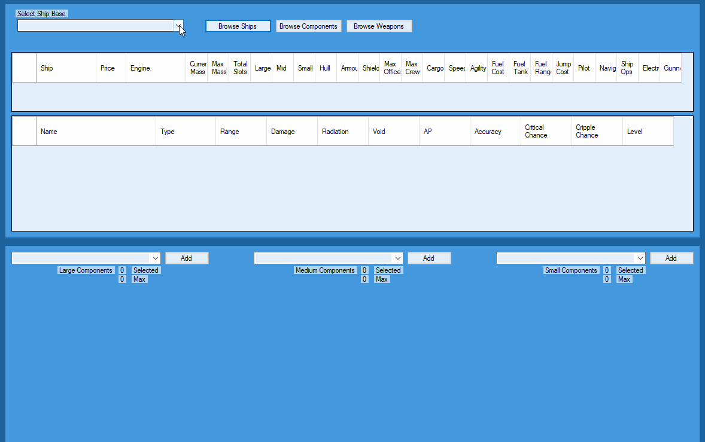
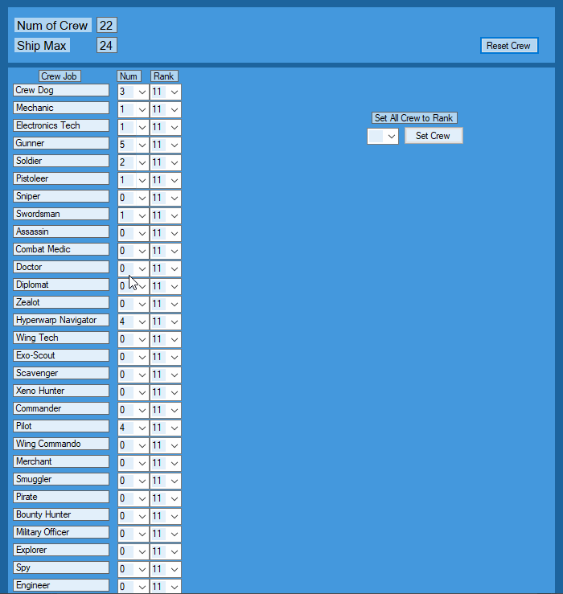
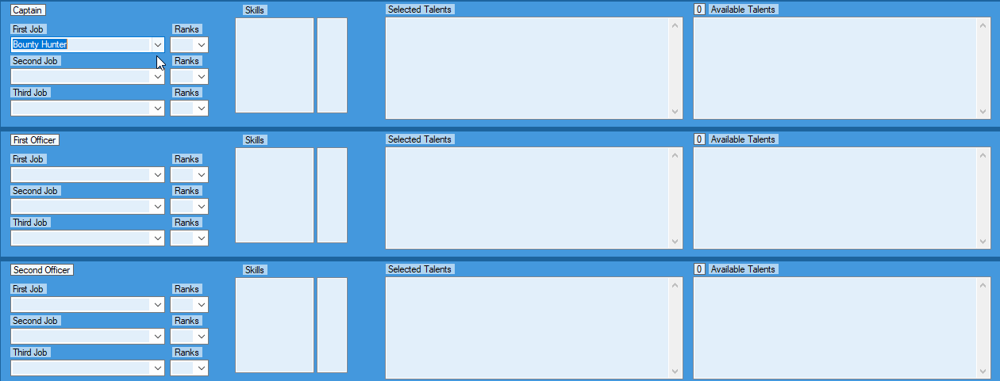
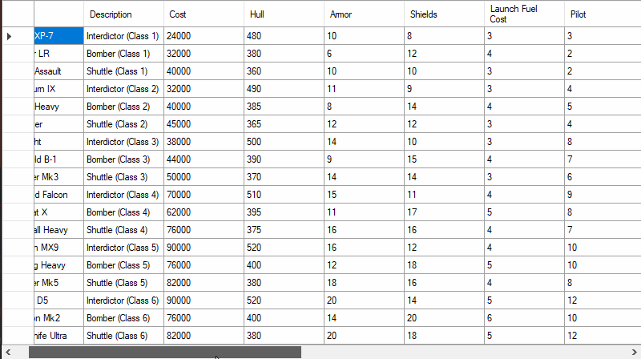

# STF_Crew_Planner
Star Traders Frontiers Crew Planner 

v0.18

## Select Your Ship!

## Select Your Crew!

## Select Your Captain and Officers!

## Browse Small Crafts!

CURRENT FEATURES
- Form now populates from newly implemented game database
- Plan Bridge Crew, up to 7 officers
- Plan Ship Layout
- Plan Non-officer Crew
- See Dice Pools for Crew and Ship
- See Ship Combat Dice Pools
- See Card Reward Pools
- Output to Text File
- Output for forum post
- Save/Load to XML
- Search All Talents by Job, Type, or Description term
- Browse All Ships
- Browse All Components
- Browse All Weapons
- Browse All Small Crafts
- Weapon Layout with range and damage

TODO
- Show direct percentage blocked for Shields/Armour
- Update Text output with table formats
- Crew Combat display and output.  Ranges, weapons, armor, talents
- Implement update button to check database version to ensure updated values following game patches/updates

CHANGELOG
v0.18
- Added Exporter class to pull game data from game database
- Exporter creates new resource files used to populate the form
- Talent points are now correctly reflected for Captain vs other officers
- Added Show Small Crafts button to display data for recently added crafts 

v0.17
- Added Forum output option.  Creates table data for easy output to TB forum
- Updated ship component list to current in-game components
- Updated for new job talents
- Updated for new job ranks and character experience levels
- Fixed a few bugs

v0.16
- Added Weapon Data and Browser
- Added Weapon Layout during config and output
- Added Engine data, engines now change to their correct stats
- Added Ship Combat Pool calculations for display and output
- Added Crew Dice Pools to output
- Added Card Game Rewards from skills to output

v0.15
- Added Ship Configuration and planning
- Added Crew Manifest and planning
- Added Display for Ship dice pools
- Updated Save/Load/Output for new data
- Various small bug fixes

v0.14
- Added ability to configure up to 7 officers total
- Sorted Selected talents by Job first, then Rank in output text and display fields
- Reformatted output text to be tab-formatted and focused on readability
- You may now clear job 2 or 3 by selecting 'None' on the dropdown
- Changing your jobs or ranks will no longer lose all selected talents. It will retain any selected talents you can still have.

v0.13
- Added Talent Search Form. Search for Talents by type, job, or term in description.
- Changed Talent related text fields to tab delimited for better readability
- Changed Text Output to use tabs instead of spaces for spacing

v0.12
- New Color Scheme
- Now user can load/save crews to XML file
